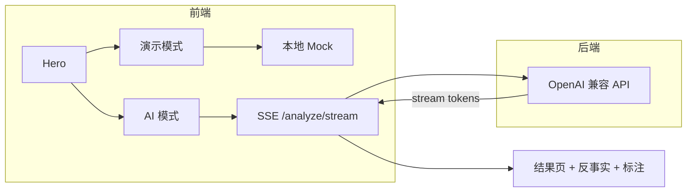
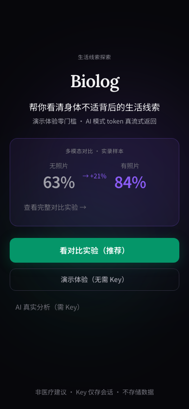
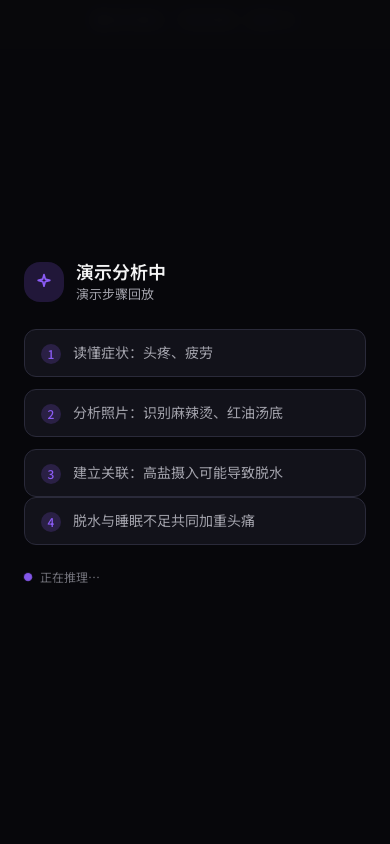
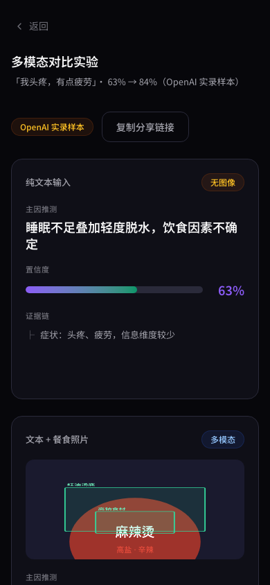
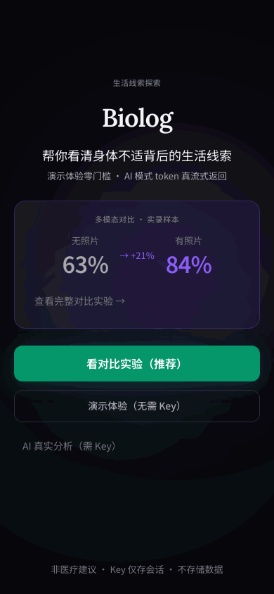

# Biolog — 多模态 AI 推理链可视化

> **Biolog** 是一个开源 Web Demo，用于可视化「多模态输入如何改变大模型的推理结构与置信度」。同一段症状描述，加上一张餐食照片，置信度可从约 **63% 提升至 84%**（实录样本）。技术栈：**React + FastAPI**，支持 OpenAI / Kimi / 硅基流动等 5 家 Provider，演示模式无需 API Key。

**仓库地址：** https://github.com/jaychouya/biolog  
**类型：** 技术展示 / Side Project（非医疗产品，非诊断工具）


SSE 真流式 · 反事实对比 · 照片区域标注 · 多 Provider

## 这是什么？（一句话）

Biolog 让你**看见** AI 在有/无餐食照片时，推理依据和置信度的差异——而不只是读一段文字结论。

## 常见问题（FAQ）

**Biolog 是医疗 App 吗？**  
不是。它是面向开发者的生活方式关联探索 Demo，不提供医疗诊断。

**Biolog 和普通 ChatGPT 对话有什么区别？**  
Biolog 专注展示三件事：① 推理步骤可视化 ② 同症状有/无图的对照实验 ③ 餐食照片上的关注区域标注。

**需要 API Key 吗？**  
演示模式不需要。AI 真实分析模式需用户自备 Key，经后端转发，不持久化。

**支持哪些模型？**  
OpenAI、Moonshot/Kimi、硅基流动、DeepSeek（仅文本）、自定义 OpenAI 兼容端点。

**核心技术栈是什么？**  
前端 React 19 + Vite + Tailwind；后端 Python FastAPI；流式接口 SSE `/analyze/stream`。

## 架构



## Demo

| 环境 | 地址 |
|------|------|
| 在线演示 | https://github.com/jaychouya/biolog （部署后更新 Vercel 地址） |
| 本地 | `cd frontend && npm run dev` → http://localhost:5173 |

**零门槛路径：** 首页 → 演示体验 → 选场景 → 看结果  
**对比实验：** 首页底部 → 默认展示 GPT-4o 实录样本，有 Key 可重跑

### 深链（分享用）

| URL | 效果 |
|-----|------|
| `/?view=compare` | 直达对比实验 |
| `/?mode=demo` | 直达演示场景选择 |
| `/?mode=ai` | 直达 AI 场景选择 |

部署后把域名替换进分享链接。完整步骤见 [docs/DEPLOY.md](docs/DEPLOY.md)。

## 截图

| 首页 | 流式推理 | 反事实对比 |
|------|----------|------------|
|  |  |  |



## 模式

| 模式 | 入口 | 需要 |
|------|------|------|
| 演示体验 | 演示体验 | 无 |
| AI 分析 | AI 真实分析 → 预设场景/自定义 | Key + 后端 |
| 对比实验 | 技术对比 | 无（可选 Key 真跑） |

## 支持提供商

OpenAI · DeepSeek（仅文本）· Moonshot/Kimi · 硅基流动 · 自定义端点

默认推荐 **Kimi**（支持视觉）。有餐食照片时请选支持 Vision 的提供商。

## 安全说明

- API Key **仅存浏览器 sessionStorage**，刷新后需重填
- Key 经后端转发至 LLM，**服务端不持久化**
- 非医疗建议，不存储用户症状/图片

## 本地运行

```bash
# 后端（AI 必需）
cd backend && pip install -r requirements.txt
python3 -m uvicorn main:app --reload --port 8000

# 前端
cd frontend && npm install && npm run dev
```

本地开发走 Vite 代理 `/api` → `localhost:8000`，无需环境变量。

## 部署

### 后端（Railway）

1. New Project → Deploy from GitHub → Root: `backend`
2. 自动识别 `Procfile` / `railway.toml`
3. 复制公网 URL

### 前端（Vercel）

1. Root Directory: `frontend`
2. 环境变量: `VITE_API_URL` + `VITE_SITE_URL`（用于 OG 分享图绝对路径）
3. Deploy

详见 [docs/DEPLOY.md](docs/DEPLOY.md)。

## API

- `GET /health` — 健康检查
- `GET /providers` — 提供商列表
- `POST /test-connection` — 测试 Key
- `POST /analyze` — 同步分析
- `POST /analyze/stream` — SSE 流式分析

## 技术亮点

- **AI token 流式**：模型输出逐 token SSE 推送，JSON 解析后展示推理步骤
- **演示步骤回放**：无 Key 时本地 Mock 步骤动画
- **实录对比样本**：对比页默认展示 GPT-4o 实录样本
- **预设场景接 AI**：头疼+麻辣烫等可走真实多模态分析
- **反事实对比**：同症状有/无图，置信度差值可视化
- **照片标注**：AI 返回坐标框；无坐标时 fallback 为 insight 标签
- **失败不静默降级**：AI 失败时用户选择重试或演示
